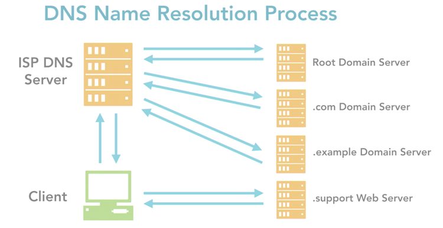
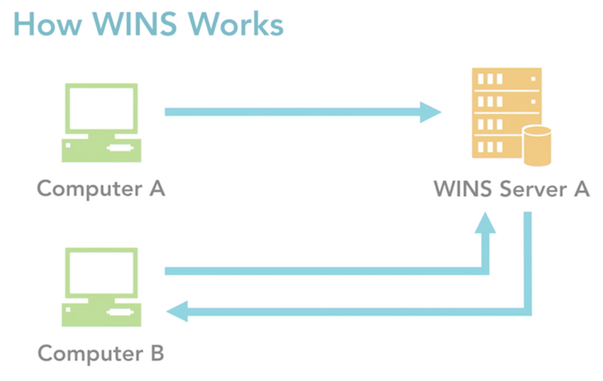
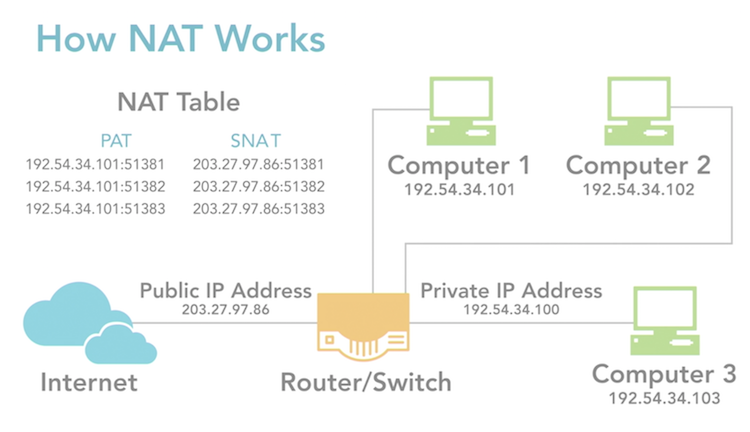

# Name & IP Address Resolution Techniques

[__<= GO BACK__](README.md)

## Overview:

1. [DHCP & How it works](#dhcp-how-it-works)
2. [DNS & How it works](#dns-how-it-works)
3. [WINS & How it works](#wins-how-it-works)
4. [## NAT & How it works](#nat-how-it-works)

## DHCP & How it works
- dynamic host configuration protocol: automatically assign IP from predefined pool (lease)
- a lease must be renewed after they are up
- prevents IP address duplicated by keeping track of IP addresses
- the DHCP server needs a static IP address

## DNS & How it works
- Domain name service/system: takes IP addresses and maps them to english like names
- consists of 3 parts:
- Namespace:
  - defines tree like structure of names, each branch identifies a different domain
  - domains contain resource records with info (host name, IP address...) queries are used to get information
- Name Server:
  - forwards queries to the correct name server & allows DNS Servers to access info about domains in the tree
- Resolver:
  - client program, generates DNS queries & sends them to the DNS server.
  - has access to at least 1 DNS server and can process queries to other servers as needed.

## WINS & How it works
- windows internet name service: registers/resolves NetBIOS names to IP addresses (replaced by DNS in modern systems)
- provides dynamic name-to-address database that maintains support for computer name registration and resolution.
- centralized management of name-to-address database. Don't have to manage Imhosts files.
- reduces NetBIOS based broadcast traffic subnets

## NAT & How it works
- network address translation: used to conserve public IP address
- commonly implemented by having a router connected to both public/private networks
- router translates IP address of the packets of private networks to public IP address
- packet is released then to the internet
- packet looks like its coming from the public IP but comes from private network
- router receives response and remembers which computer in the private network made the request.
- router translates the IP address back to the private IP address and sends the response to the correct computer.

