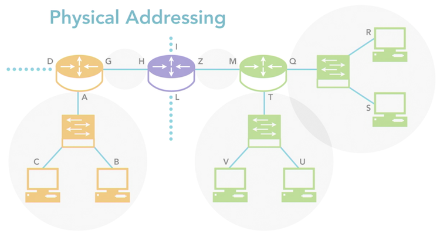
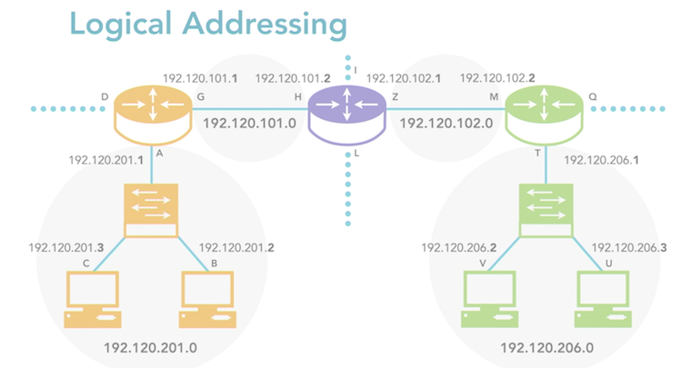

# Understanding Addressing

[__<= GO BACK__](README.md)

## Overview:

1. [Physical Addressing](#physical-addressing)
  * Mac Addressing
  * Variations
2. [Logical Addressing](#logical-addressing)
  * IP Addressing
3. [How Logical & Physical Addressing Work Together](#how-logical-physical-addressing-work-together)
4. [Unicast/Broadcast/Multicast](#unicast-broadcast-multicast)
5. [Broadcast Domains vs. Collision Domains](#broadcast-domains-vs-collision-domains)

## Physical Addressing

- actual physical address of device also known as Mac Address
- assigned when manufactured cannot be assigned afterward

### Mac Addressing
- expressed in hexadecimal (48 bits long) and consists of 2 parts
- part 1:
  - OUI (Organizational Unique Identifier)
  - 24 bits long & specifies the manufacturer
  - must be registered by the manufacturer to avoid OUI conflicts
- part 2:
  - Host portion, 24 bits long & changes for each device
  - allows 16 million unique Mac Address
  - no 2 device can have the same Mac Address can cause interference

### Variations
- 60 bit (EUI-60) Extended Unique Identifier:
  - 60 bits long, 24 bits OUI, 36 bits Host portion
  - works the same as basic Mac Address
- 64 bit (EUI-64) Extended Unique Identifier:
  - 64 bits long, 24 bits OUI, 40 bits Host portion
  - can work with IPv6 to create unique IPv6 addresses

## Logical Addressing

- all devices need a logical address (determined by logical layer Protocol)
- almost all networks use TCP/IP (IP logical addressing)

### IP Addressing
- IP addresses can be entered manually (static IP) or automatically (dynamically)
- 2 main ways of dynamic IP address assignment:
  - DHCP: Dynamic Host Control Protocol (requires server)
  - APIPA: Automatic Private Internet Protocol Addressing (only microsoft OS)
- a 0 (zero) at the end of an IP address indicates a network Address subnets use the base IP address of the network address

## How Logical & Physical Addressing Work Together

- Computer 1 has its Logical & Physical Address
- Computer 1 sends packet to Computer 2
- The packet has the destination Logical Address & the next physical address
- It leaves the computer and reaches first destination (router)
- Router changes physical address to next destination (router)
- This repeats until the packet reaches the destination Computer 2 (logical address)

## Unicast/Broadcast/Multicast

- Unicast: 1 device sends 1 packet to only 1 other device
  - one to one communication
  - most common type of communication
- Broadcast: 1 device sends 1 packet to all available devices
  - one to everyone communication
- Multicast: 1 devices send 1 packet to a group of devices
  - one to many communication

## Broadcast Domains vs. Collision Domains

- Broadcast Domain:
  - all devices are able to receive a signal sent by another computer in the network
  - signal cannot pass a switch, router or similar device to be part of a Broadcast domain
- Collision Domain:
  - 2 or more device signals interfere with each other (collision)
  - bus topology (ex. hubs) create collision domains, not an issue due to switches (don't allow collision)
  - modern networks use different pairs of wires for sending & receiving
