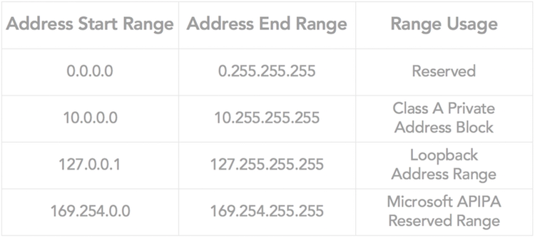
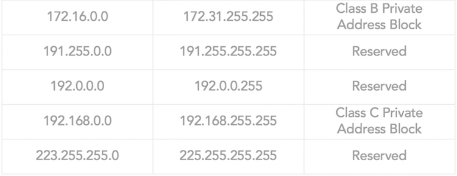

# IPv4 Addressing

[__<= GO BACK__](README.md)

## Overview:

1. [IPv4 and IPv4 Addressing Structure](#ipv4-and-ipv4-addressing-structure)
2. [IPv4 Classful Addresses](#ipv4-classful-addresses)
3. [IPv4 Classless IP Addresses](#ipv4-classless-ip-addresses)
4. [Reserved IP Address Ranges & Loopback](#reserved-ip-address-ranges-loopback)
5. [Private vs. Public Addressing & APIPA](#private-vs-public-addressing-apipa)
6. [IPv4 Subnetting](#ipv4-subnetting)
7. [Default Routes and Gateway Setting](#default-routes-and-gateway-setting)
8. [Subnet Mask & Subnet Mask setting](#subnet-mask-subnet-mask-setting)

## IPv4 and IPv4 Addressing Structure
- 32 bit long, broken in 8 bits segments (octets)
- each octet represented by decimal equivalent, separated by decimal point

## IPv4 Classful Addresses
- originally IPv4 were separated into classes (A,B,C,D and E) but no more

## IPv4 Classless IP Addresses
- currently used
- network portion of address determined by subnet mask
- use CIDR notation to show subnet
  - Classless Inter-Domain Routing: since 1993, preferred by ICANN
  - generally starts with 24 bits network address & 8 bits for the host ID
  - w.x.y.z/a format: `a` is the number of bits used for network ID

## Reserved IP Address Ranges & Loopback
- IP addresses set aside by ICANN for specific uses
- Loopback IP:
  - set of reserved IP addresses for specific functions
  - an interface to send a signal back to itself
  - useful for testing & setting up an interface that is not present but addressable

## Private vs. Public Addressing & APIPA
- public addressing:
  - interface that needs internet access (not required if not)
  - needs to be registered with ICANN
  - only registered public addresses are allowed direct access to the internet
- private addressing:
  - only if not directly accessing the internet
  - certain IP address range are predefined by ICANN as private
  - defined in RFC 1918, ICANN never assigns these IP addresses for public use
  - for private networks used IP address from the private range
- APIPA:
  - Automatic Private Internet Protocol Addressing, created by microsoft for Windows 9x & higher
  - used when windows computer is set to automatically find IP address & DHCP is not available

## IPv4 Subnetting
- break larger network into smaller ones, each one is called subnet
- each smaller networks is used with less computers (prevents waisting IP addresses)
- can't use first IP in the range because it's a network address (specific network)
- can't use last IP in the range because it's a broadcast address (messages to all devices on network)

## Default Routes and Gateway Setting
- default routes:
  - defines 1 route that summarizes all the locations not on local subnet
  - offloads responsibility of knowing all possible locations from the Computer to a router
- default gateway setting:
  - provides "next hop" destination for all destinations not located on the local network segment
  - DHCP configures default gateway on the server and sends it, but can be done manually

## Subnet Mask & Subnet Mask setting
- subnet mask:
  - IP address used by computer to determine host and network portion
- subnet mask setting:
  - setting in network configuration, tells computer what subnet mask to use for interface 
