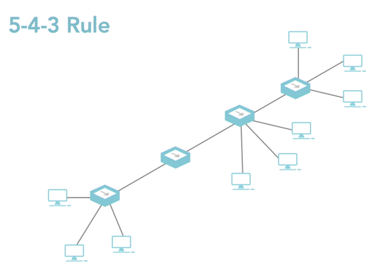

# Commonly Used Network Devices

[__<= GO BACK__](README.md)

## Overview

1. [NICs](#nic-network-interface-card-controller-)
2. [Hubs](#hubs)
3. [Bridges](#bridges)
4. [Switches](#switches)
5. [Routers](#routers)
6. [Access Points](#access-points)

## NIC (Network Interface Card/Controller)

- allows computer/device to connect to the network:
  - comes as a expansion card
  - USB Device
  - Installed on the motherboard
- must match the technology used:
  - 802.11n Wifi needs 802.11n NIC
  - gigabit ethernet network needs gigabit ethernet NIC
  - token ring network needs a token ring NIC
  - etc.

## Hubs

- older technology
- is being replaced by Switches
- works on the layer 1 of the OSI model
- logically functions as a Bus topology
- too many hosts can result in constant collision
-  there 3 main types of Hubs (seen below)

|Passive Hubs| Active Hubs | Intelligent Hubs |
|------------|:------------|:-----------------|
|Works like cable splitter |Need a power source (added to the signal)  |Active Hubs with additional features |
|More devices = weaker signal to each device |No weakening of signal with multiple devices (due to power source) |Some have network diagnostic ability  |
|   |Repeats signal to all hosts connected to Hub |Some have management ability |
|   |Can be used to connect multiple Hubs (*must follow 5-4-3 rules) |   |

> 5-4-3 rule:
>
> 5: no more than 5 segments can be linked together
>
> 4: up to 4 linking devices only can be used to form segments
>
> 3: only 3 segments can be populated by computers

## Bridges

- used to break up network into smaller segments
- connects two smaller segments with half the number of computers on them
- this results in fewer collisions
- older technology
- works on layer 2 of the OSI model  (like switch)
- can read frames to determine if they are allowed to pass

## Switches

- used to connect multiple computers together
- primarily works on layer 2 of the OSI model (some work on higher layers)
- multilayer switch: one that works on more than 1 layer

### Switch Types

|Basic Switch (Most Common) |Managed Switch |Unmanaged Switch |
|-------------|---------------|-----------------|
|essentially a multiport bridge |variation of basic switch   |variation of basic switch |
|separate network into smaller segments (collision domains)  |is programmable   |come with default configuration |
|converts media |controls how data behaves on network |can only change in predefined limits |
|uses ports to setup port-to-port connections |often found in corporate environments |common in Home/SOHO switches |
|results in no collision on network |
|allows ports to communicate full speed |
|makes it hard to listen to traffic on network  |

## Routers

- move data around large networks like WANs
- primarily works on layer 3/4 of the OSI Model
- are intelligent & make independent decisions about sending data:
  - Hops: number of nodes a packet passes though to get to destination
  - Network Traffic: choses networks with less traffic
  - Throughput: how fast data can move
  - Network reliability: most reliable network
- they create tables based off this information
- they update tables to always know the best route
- they are programmable: interface configuration, network connection, what is not allowed to pass through
- can be programmed for multiple protocols

## Access Points

- devices that allow computers to access the network
- commonly used to connect home computers to the network
- can be wired or wireless but wireless is the most common in Homes & SOHO
- WAP: Wireless Access Point
