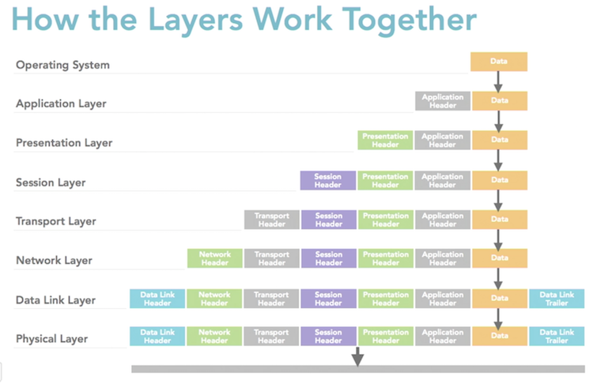
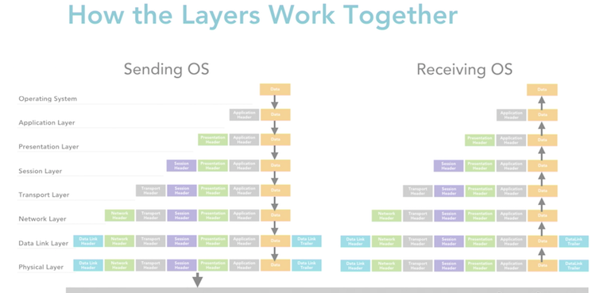

# OSI Models

[__<= GO BACK__](README.md)

- Open system interconnections reference model
- Created as a reference model and teaching aid
- Not intended to reflect actual Networking architecture
- Teach how protocols & networks work to carry data
- It has 7 layers (seen below)

__2 Parts of the OSI Model:__
- Abstract: actual model with its 7 layers
- Specifically created Protocols: Protocols not used on Networks

|7 layers          |
|------------------|
|Application Layer |
|Presentation Layer|
|Session Layer     |
|Transport Layer   |
|Network Layer     |
|Data Link Layer   |
|Physical Layer    |

## Index Layers

1. [Physical](#physical)
2. [Data Link](#data-link)
3. [Network](#network)
4. [Transport](#transport)
5. [Session](#session)
6. [Presentation](#presentation)
7. [Application](#application)

### Physical

- layer 1: physical transmission of raw data
- transmitted in 1s and 0s
- defines encoding methods to transmit data
- defines how bits are placed on media
- defines how bits start and stop
- defines media usage specification
- defines media kinds permitted
- defines how physical connection are made
- defines pin usage in physical connection

### Data Link

- layer 2: error free transmission from node to node over physical media
- establishes and terminates links from adjacent nodes
- responsible for traffic control
  - transmits and receives frames sequentially
  - responsible for frame acknowledgement
  - provides and expects frame acknowledgement
  - detects and recovers from errors on the physical layer
  - retransmits non acknowledged frames
  - handles duplicate frame receipt
- responsible for frame delimiting
  - create & recognize frame boundaries (when frame starts & stops)
  - let nodes know when the frame starts & ends
- responsible for error checking
  - checks received frames for integrity
- provides media access management
- determines when node is allowed to use physical layer

### Network

- controls operation of subnetworks it is on
  - determines best physical path for data (conditions):
  - network condition, priority of service, hubs, throughput, etc.
- routing
  - routes frames among connected networks
- subnet traffic control
  - allows routers to send instructions to sending nodes to "throttle back" transmissions when buffers are filled
- frame fragmentation
  - determines frame size of routers located down stream
  - frame size == maximum transmission unit size
  - router fragments/reassemble frame if too big
- logical-physical address mapping
  - translates logical address into physical address
- subnet usage accounting
  - keep track of frames forwarded by subnet intermediate systems
  - uses this to produce billing information
- build headers used by network layer on other devices to route packets to destination
- relieves higher layers of the need to know data transmission & switching technologies
- send data to destinations separated by intermediate nodes
  - send information to adjacent nodes

### Transport

- ensures message delivery: error-free, in sequence, without loss/duplicate
- relieves higher protocols of concern for transfer of data
- size & complexity depends on the Network Layer service
- message segmentation
  - accepts & splits messages from section layer
  - imposes message size limits on the layers below
  - prepares header for each smaller unit created
  - sends smaller units to the network layer & reassembles at destination
  - generates headers for each small unit (start, end flags, sequence info)
- message acknowledgement
  - reliable end to end delivery of messages
  - acknowledgement on both ends (both know if message was send/received)
- message traffic control
  - controls rate of traffic send when no buffers available
- session multiplexing
  - breaks data coming in from 1 link into separate data streams (sessions) and tracks which message belongs to which session

> Transport layer & above: Not responsible for transmission between nodes
>
> Transport layer & above: responsible for transmission (source <-> destination)
>
> Source to Destination == End to End transmission
>
> Upper layers are not concerned with underlying communication facility

### Session

- establishes sessions between processes running on different computers (already connected)
- provides functions for the session to do this:
  - establishment, maintenance, termination & support
- allows process on different machines to to do several things:
  - allow process to establish connection
  - allow process to use connection
- allows processes to communicate over network:
  - security, name recognition, logging on, etc.

### Presentation

- formats data for the application layer
- translator for network
  - sends data in common format
  - receives data in common format and translate to application format
  - ex: character code translation & Data Conversion
- data compression
- data encryption

### Application

- window for uses and applications to access the network service
- provides function:
  - remote sharing, device redirection, remote file access, remote printer access, network management, email, instant messaging, etc.

## Encapsulation and De-capsulation

- each layer of the OSI model adds a header
- layers create a unit to send or receive data
- Encapsulation: move (down) data Application Layer -> Physical Layer
- De-capsulation: move (up) data Physical -> Application Layer
- each layer has an Encapsulation unit for the data:
  - Application, Presentation & Session => Data
  - Transport => Segments
  - Network => Packets
  - Data Link => Frame
  - Physical => Bits

