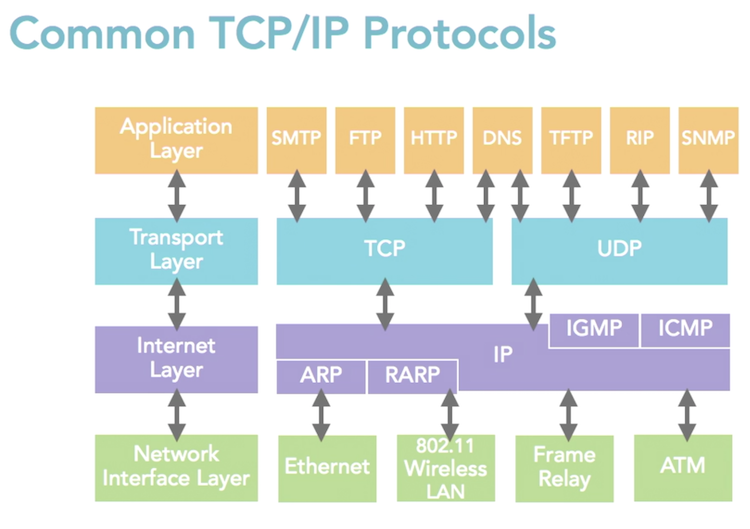

# TCP/IP Model

[__<= GO BACK__](README.md)

## Overview

1. [TCP/IP Suite](#tcp-ip-suite)
2. [TCP/IP Model](#tcp-ip-model)
3. [TCP/IP Model vs. OSI Model](#tcp-ip-model-vs-osi-model)

## TCP/IP Suite

- Group of protocols designed to work together to send data across network
- Named after 2 major protocols:
  - TCP => Transport Control Protocol
  - IP => Internet Protocol
- It is an open Protocol suite (free to use)
- New protocols can be freely developed as needed
- The internet uses and most other networks use it as well

## TCP/IP Model

- Created by Department of Defense
- Is a reduced version of the OSI model. Based on TCP/IP Suite (4 layers, seen below)
- All TCP/IP Protocols are located on the top 3 layers (Application, Transport, Internet)
- Protocols on the bottom layer (Network Access) are not part of the suite
- Each layer corresponds to 1 or more OSI model layers

|TCP/IP Layers              |
|:-------------------------:|
|[Application](#application)|
|[Transport](#transport)    |
|[Internet](#internet)      |
|[Network](#network)        |

### Application

- defines protocols, services and processes that allow programs and users to interface with the network
- defines how the users interface with the transport layer to use the network.
- Common application layer protocols:
  * HTTP, Telnet, FTP, TFTP, SNMP, DNS, SMTP

### Transport

- provides communications session communication between host computers
- defines level of service and status of connections used when transporting data
- Common Transport Layer protocols:
  * TCP => Transport Control Protocol
  * UDP => User Datagram Protocol
  * RTP => Realtime Protocol

### Internet

- packages data into IP datagrams called packets
  * header of packets contains source & destination information
  * uses this info to forward packets between hosts
- it performs routing of IP Packets
- common internet layer protocols:
  * IP => Internet Protocol
  * ICMP => Internet Control Message Protocol
  * ARP => Address Resolution Protocol
  * RARP => Reverse Address Resolution Protocol

### Network

- how data is physically sent through a network
- how bits are electrically signaled by hardware
- how hardware devices interface with network medium
- ex: coaxial cable, optical cable & twisted pair cable
- standards defined by this layer:
  * Ethernet => most common in LAN
  * Token Ring => Not more used commonly
  * FDDI => Used for fiber optics (LAN)
  * X.25 => Used in the past for (WAN)
  * Frame Relay => Used sometimes in WAN

## TCP/IP Model vs. OSI Model

|TCP/IP Model     | OSI Model        |
|-----------------|------------------|
|Application Layer|Application Layer |
|                 |Presentation Layer|
|                 |Session Layer     |
|Transport Layer  |Session Layer     |
|                 |Transport Layer   |
|Internet Layer   |Network  Layer    |
|                 |Data Link Layer   |
|Network Layer    |Data Link Layer   |
|                 |Physical Layer    |
